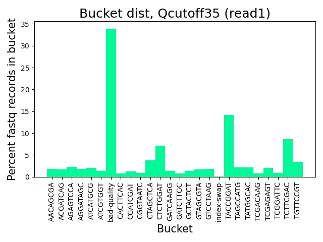
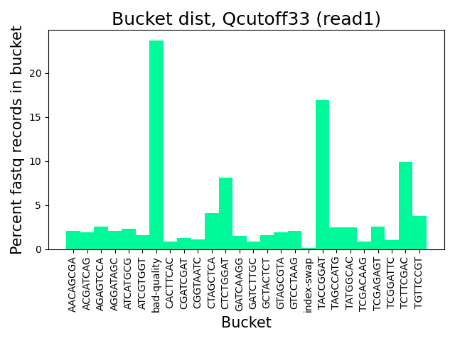
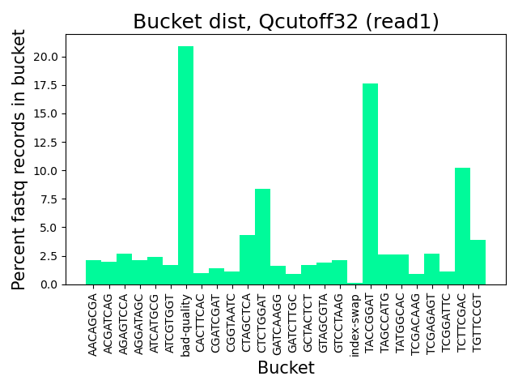
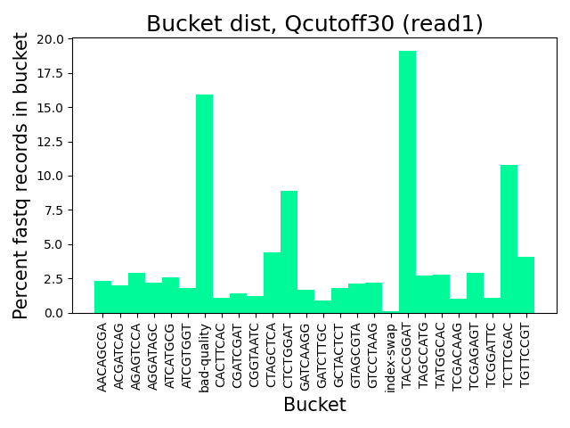

# Cool Statistics from Demultiplexing

## Bad Quality and Index Hopping Percentages

### Average Qscore 35
>With an avg Qscore cutoff of 35, the percent of records in bad_quality bucket is:  33.9 %

>With an avg Qscore cutoff of 35, the number of records in bad_quality bucket is:  123143711

>With an avg Qscore cutoff of 35, the percent of records in index swapped bucket is:  0.1 %

>With an avg Qscore cutoff of 35, the number of records in index swapped bucket is:  352378

### Average Qscore 33
>With an avg Qscore cutoff of 33, the percent of records in bad_quality bucket is:  23.7 %

>With an avg Qscore cutoff of 33, the number of records in bad_quality bucket is:  86216752

>With an avg Qscore cutoff of 33, the percent of records in index swapped bucket is:  0.1 %

>With an avg Qscore cutoff of 33, the number of records in index swapped bucket is:  435416

### Average Qscore 32
>With an avg Qscore cutoff of 32, the percent of records in bad_quality bucket is:  20.9 %

>With an avg Qscore cutoff of 32, the number of records in bad_quality bucket is:  75990424

>With an avg Qscore cutoff of 32, the percent of records in index swapped bucket is:  0.1 %

>With an avg Qscore cutoff of 32, the number of records in index swapped bucket is:  461756

### Average Qscore 30
>With an avg Qscore cutoff of 30, the percent of records in bad_quality bucket is:  15.9 %

>With an avg Qscore cutoff of 30, the number of records in bad_quality bucket is:  57748853

>With an avg Qscore cutoff of 30, the percent of records in index swapped bucket is:  0.1 %

>With an avg Qscore cutoff of 30, the number of records in index swapped bucket is:  517612

## Distributions

#### Here are some really nice bar plots of the percentage of each read 1 bucket relative to the entire read 1 population.

